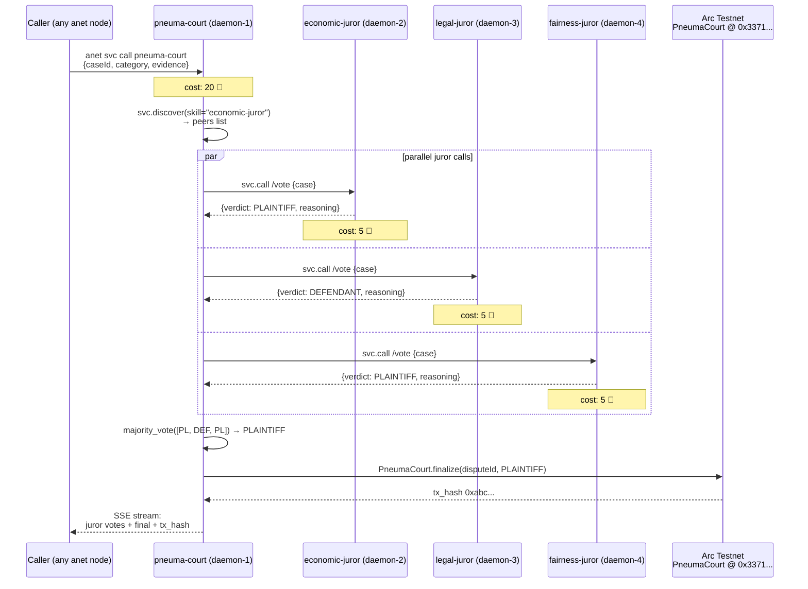

# Architecture

## Service-of-services on anet, finalized on Arc Testnet

## Why each layer exists

### Layer 1 — anet P2P mesh

- Service discovery without hard-coded peer IDs
- Per-call billing in 🐚 Shell credits, settled cross-daemon by anet wallet
- Audit trail per node via `svc_call_log`

### Layer 2 — Court orchestration

- Translates "dispute category" → list of relevant juror skills
- Parallel fan-out + result aggregation
- Streams partial results as SSE so the caller sees deliberation in real time

### Layer 3 — Juror agents

- Each is an independent anet service with a domain-specific Claude prompt
- Stateless — every call gets a fresh reasoning pass
- Independent registration means anyone in the world can stand up a `<x>-juror` and the court will discover it

### Layer 4 — On-chain finalize

- Off-chain mesh deliberation produces a verdict
- Verdict is committed to `PneumaCourt.finalize()` on Arc Testnet
- Result: cryptographically verifiable, censorship-resistant ruling

## Why this architecture rules out centralized backends

A single backend running all 3 jurors:
- Shares state → biases compound across jurors
- One API key → one operator can silently rewrite verdicts
- No `svc_call_log` audit per juror → no independent accountability

A P2P mesh:
- Each juror's daemon owns its audit log; rewriting requires N-party collusion
- Anyone can register a competing juror with the same skill tag
- The court's discover/aggregate logic is the only thing that needs to be trusted, and it's open-source in this repo
